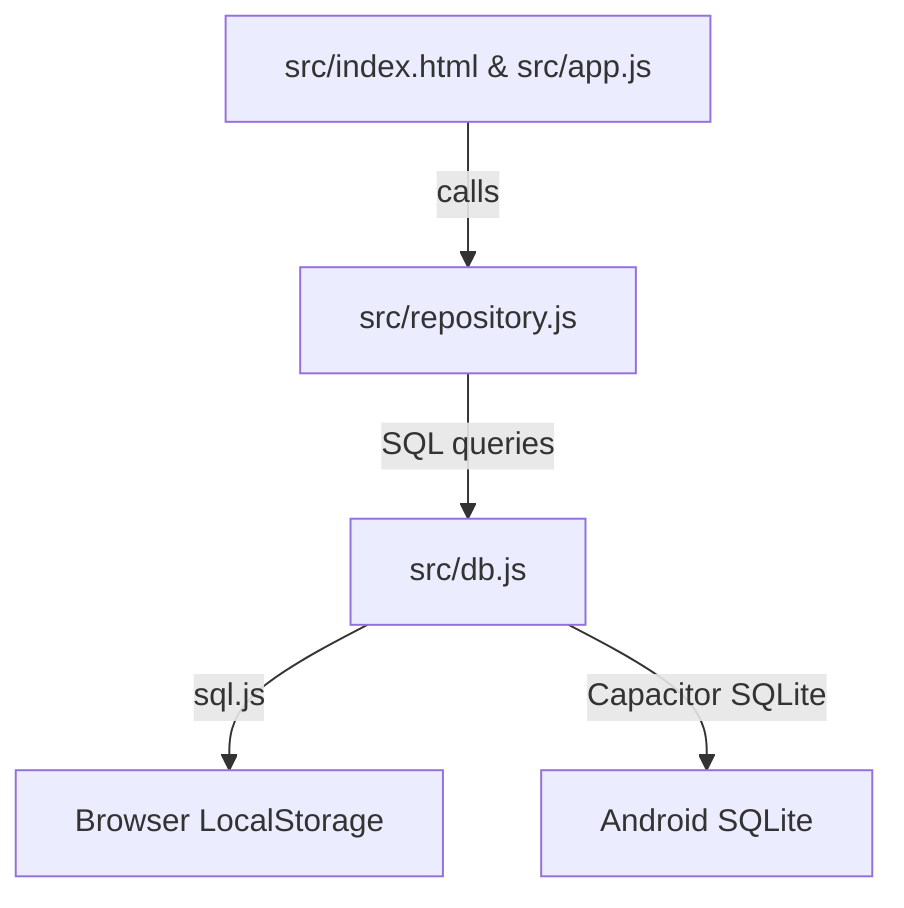

# Architecture

> Auto-generated by /map on 2026-03-01

## Overview

Chore Chart is a "Digital magnetic bulletin board" application designed for managing household chores. It supports both web-based usage and native Android deployment via Capacitor.

## Components

### UI Layer (`src/app.js`, `src/index.html`, `src/style.css`)

- **Purpose**: Handles rendering the chore board, participant palette, and settings modal.
- **Location**: `src/`
- **Responsibilities**:
    - Event binding for drag-and-drop.
    - DOM manipulation for dynamic board updates.
    - Managing modal states (settings, rotations).

### Data Access Layer (`src/repository.js`)

- **Purpose**: Implements the Repository pattern to decouple UI from data storage.
- **Location**: `src/repository.js`
- **Responsibilities**:
    - High-level CRUD for Actors (People/Groups), Chores, and Assignments.
    - Logic for group rotations and hierarchical group memberships.
    - Settings management.

### Persistence Layer (`src/db.js`)

- **Purpose**: Manages low-level SQLite database operations and schema.
- **Location**: `src/db.js`
- **Responsibilities**:
    - Platform detection (Web vs Native).
    - Database initialization and schema migrations.
    - Executing SQL queries and handling persistence to LocalStorage (for web) or native storage (for Android).

## Data Flow

1. **User Interaction**: User drags a marker to a cell in `app.js`.
2. **Repository Call**: `app.js` calls `ChoreRepository.addAssignment(choreId, dayIndex, actorId)`.
3. **Database Execution**: `repository.js` sends a SQL `INSERT` to `db.js`.
4. **State Persistence**: `db.js` executes the query and (on web) calls `saveDatabase()` to persist to `localStorage`.
5. **UI Refresh**: `app.js` re-renders the board to reflect the new state.

## Integration Points

| Service          | Type           | Purpose                               |
| ---------------- | -------------- | ------------------------------------- |
| sql.js           | Library (WASM) | SQLite engine for web browsers.       |
| Capacitor SQLite | Plugin         | SQLite engine for native Android.     |
| Capacitor        | Framework      | Native bridge for Android deployment. |

## Technical Debt

- No standard `TODO`/`FIXME` markers found in `src/`.
- Heavy reliance on global `window` objects for exposing `ChoreRepository` and `renderBoard` (primarily for E2E testing).
- Dual storage logic in `db.js` adds complexity for maintenance.

## Conventions

**Naming**: CamelCase for functions and variables, snake_case for database columns and settings keys.
**Structure**: Separation of concerns between UI (`app.js`), Data Access (`repository.js`), and DB (`db.js`).
**Testing**: Extensive test suite in `tests/` covering actors, assignments, chores, and e2e flows.
