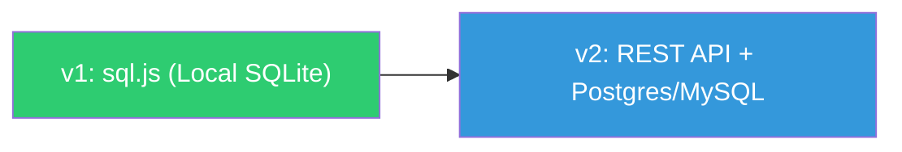

# Project Bible: Chore Chart

> **Purpose**: This document contains the **static DNA** of your project—the unchanging foundations that guide all decisions.

---

## 📍 North Star

### Project Name

**Chore Chart**

### One-Line Objective

> A digital representation of a magnetic bulletin board chore chart, designed for clear and tactile household task management.

### Project Vibe / Philosophy

- **Physical-to-Digital**: Mimics the tactile feel of a magnetic board with a clean, modern interface.
- **Visual Clarity**: A bird's-eye view of the week, ensuring responsibility is obvious at a glance.
- **Mobile-First**: Designed as an Android app (simulated via responsive web) for quick interaction.
- **Privacy & Security First**: User data is sacred. Local-first architecture ensures data stays on-device whenever possible. Security is a non-negotiable foundation.

---

## 🎯 Core Goals

### Primary Goals

1. **The Grid Interface**: A weekly grid with days as columns and chores as rows.
2. **Marker System**: Visual markers (representing people) that can be placed in grid cells to assign responsibility.
3. **Tactile UX**: Smooth interactions that feel like moving magnets.
4. **Android Aesthetics**: Ensuring it feels at home on a mobile device.
5. **Absolute Privacy**: Zero-latency local storage with no external dependencies by default.

## 🏗️ Technical Foundation

### Tech Stack

- **Frontend**: Vanilla HTML5, CSS3 (Modern features like Grid and Flexbox)
- **Logic**: ES6+ Javascript (Reactive State Management)
- **Node Environment**: Node.js managed via `nvm` (Node Version Manager) in the home directory.
- **Local Database**: sql.js (SQLite compiled to WebAssembly)
- **Future Remote Database**: PostgreSQL or MySQL (via REST API)

### Architecture Principles

1.  **Skeuomorphism**: Using shadows and depth to mimic physical magnets.
2.  **State-Driven UI**: The grid updates automatically when a "marker" is moved.
3.  **Responsive Grid**: Fluid layout that preserves the board's structure across devices.
4.  **Repository Pattern**: All data access is abstracted behind a clean interface (`ChoreRepository`). The app never interacts with the database directly — only through the repository. This allows swapping from local SQLite to a remote Postgres/MySQL backend without changing any UI or business logic code.

### Data Persistence Roadmap

| Phase           | Storage                 | How It Works                                                                                               |
| --------------- | ----------------------- | ---------------------------------------------------------------------------------------------------------- |
| **v1 (Now)**    | sql.js (SQLite in WASM) | Data stored locally in the browser. SQL schema and queries written once.                                   |
| **v2 (Future)** | Postgres / MySQL        | Swap the repository implementation to call a remote API. Schema and queries transfer with minimal changes. |

---

## 👥 Stakeholders & Roles

### Target Users

- **Household Members**: The primary users who assign and track chores.
- **Chore Overseers**: Users who manage the list of chores and the schedule.

### AI Role

- **Engineering Partner**: Designing the UI/UX, implementing the logic, and ensuring the "magnetic" feel.

---

## 🚧 Constraints & Boundaries

- **Mobile-First**: The primary interface must be optimized for Android screens.
- **No Backend (v1)**: All data stored locally via sql.js for privacy and simplicity.
- **SQL-First**: All data access uses standard SQL to ensure portability to remote backends.
- **Protocol Security**: To ensure security and strict cross-platform portability, avoid relying on the `file://` protocol for loading assets, modules, or executing code. Local structures should be tested in an environment that behaves like standard network protocols (e.g. `http://` via a local static server) whenever possible.
- **License Constraint**: Only open-source licenses permitting redistribution and hosting (e.g., MIT, ISC, Apache 2.0, AGPL, BSD, OFL, BlueOak) are permitted for any project assets or libraries.
- **Documentation Portability**: For privacy and seamless portability across environments, never reference explicit local machine paths (e.g., `/home/username/`, `C:\Users\`) in commit messages, status documents, implementation plans, or codebase documentation. Always use relative paths or generic variables.
- **Secrets Management**: Secrets (passwords, API keys, private keys, etc.) must NEVER be checked into the repository or included in commit messages. All secrets must be handled via secure environment variables or a dedicated key management system.

---

## 🔄 Process & Workflow

### Code Quality & Linting

- **Mandatory Linting**: All JavaScript, HTML, CSS, and Markdown files must pass automated formatting (Prettier) and static analysis (ESLint) before being committed.
- **Pre-commit Hook**: A `husky` pre-commit hook automatically runs these checks on staged files. Bypassing this hook is strictly prohibited.
- **CI Enforcement**: The `CI` pipeline in GitHub Actions will explicitly fail if any linting or formatting errors are present in a Pull Request.

### Environment & Tool Verification

- **Tool Prerequisites**: Before starting _any_ new task, the environment and access to required tools must be explicitly verified.
- **Task Documentation**: Any Task List, Walkthrough, or Implementation Plan _must_ include a dedicated section listing the specific tools and software required to complete the work.
- **NVM Usage**: Always ensure the correct Node.js environment is active by sourcing `nvm` (`source ~/.nvm/nvm.sh`) before executing Node/NPM commands.

### Task Management & Checkpoints

- **Mandatory Checkpoints**: All significant task lists or implementation plans must include explicit checkpoints after each primary phase of work.
- **User Review Required**: Every Implementation Plan must contain a dedicated `## User Review Required` section that explicitly asks the user for their preference or approval on proposed architectural/design choices before execution begins.
- **Clarification Questions**: When presented with a major new work request, the AI must ask at least two (and up to five) clarifying questions to ensure the scope and intent are fully understood before generating an implementation plan.
- **Checkpoint Protocol**: At each checkpoint, the AI must:
    1.  **Review the Bible**: Explicitly state that it has re-read `PROJECT_BIBLE.md`.
    2.  **Work Summary**: Provide a brief, bulleted summary of all work done in the current session.
    3.  **Next Steps**: Clearly state the immediate next moves and how they align with Bible constraints.
    4.  **Verification**: Confirm that non-negotiables (like GPG signing and Emojis) are being correctly applied.
    5.  **Notify User**: Use the `notify_user` tool to pause and await confirmation before proceeding.

### Documentation Updates

- **Explicit Approval Required**: User input and explicit acceptance are strictly required before committing any changes to `MASTER_STATUS.md` or `PROJECT_BIBLE.md`. Always present the proposed changes to the user and await confirmation before executing the `git commit` command for these files.

### Pull Request Protocol

1.  **Update Master Status**: Before submitting a PR, `MASTER_STATUS.md` must be updated to reflect all work done in that branch. This ensures the living document is always in sync with the codebase.
2.  **Security Review**: After creating a PR, review it for any identified security issues (e.g., CodeQL alerts, dependency vulnerabilities). All security findings **must** be resolved before merging.
3.  **Third-Party License Tracking**: Any new library or asset (fonts, icons, WASM blobs) added to the repository must be documented in `LICENSE-THIRD-PARTY.md` with its source, files, and license.

### Commit Signing

- **All commits must be GPG-signed.** Never use `--no-gpg-sign`. If GPG signing fails, resolve the GPG agent issue rather than bypassing signing.
- **Emoji Prefix**: All commit messages must start with a relevant emoji (e.g., ✨ for new features, 🐛 for bug fixes, 📝 for docs). This is enforced via a git hook.

### Versioning

- **Semantic Versioning**: The project follows [Semantic Versioning](https://semver.org/) (MAJOR.MINOR.PATCH).
- **Current Version**: `v0.0.3` (Capacitor & Async Storage).

### Artifact Naming Convention

When generating on-demand artifacts (e.g., APKs, Source Archives) via GitHub Actions, the following naming convention is used to ensure compatibility across all operating systems while preserving branch hierarchy:

`chore-chart-[type]--[branch]--[timestamp]`

- **Slash Replacement**: Slashes (`/`) in branch names are replaced with **Double Hyphens** (`--`). This distinguishes branch hierarchy from existing single hyphens or underscores in branch names.
- **Timestamp Format**: All timestamps use the format `YYYY-MMM-DD_HHMM_Z` in UTC, with the month and 'Z' in uppercase for maximum readability.
- **Example**: `chore-chart-apk--feature--tactile-ux--2026-FEB-23_0313_Z.apk`

### Release Signing & Automation

To ensure the integrity of software downloads, all on-demand and release artifacts are GPG-signed.

- **Verification Data**: Every release must include:
    - **GPG Signatures** (`.asc`) for all primary artifacts.
    - **SHA256 Checksums** (`.sha256`) for all primary artifacts.
    - **Signed Checksums** (`.sha256.asc`) to ensure the integrity of the checksum file itself.
- **Automation**: Workflows are triggered manually or automatically when a GitHub Release is published.
- **Signing Key**: A dedicated project-level "Release Key" is used.
- **Secrets & Variables Required**: The following repository configuration must be set for signing to function:
    - `GPG_PRIVATE_KEY` (Secret): Base64 encoded private GPG key.
    - `GPG_PASSPHRASE` (Secret): Passphrase for the private key.
    - `GPG_FINGERPRINT` (Variable): The unique fingerprint of the release key for easy verification.
- **Setup Script**: A non-interactive setup script is provided at `scripts/setup-release-gpg.sh`. It automates key generation, GitHub Secret setup, and public key publication to `keys.openpgp.org`.
    - **Verification**: Always verify releases using the **Key Fingerprint** rather than just the email address. The fingerprint is unique and prevents spoofing on keyservers where multiple keys might claim the same email.
    - **Customization**: Use `RELEASE_GPG_NAME` and `RELEASE_GPG_EMAIL` environment variables to override the default identity.
