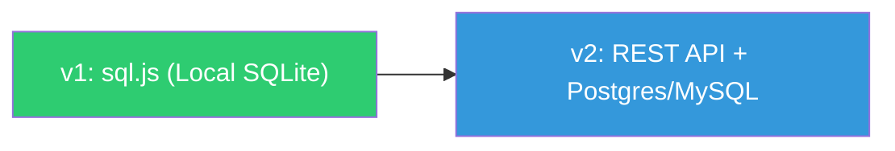

# Project Bible: Chore Chart

> **Purpose**: This document contains the **static DNA** of your project—the unchanging foundations that guide all decisions.

---

## 📍 North Star

### Project Name
**Chore Chart**

### One-Line Objective
> A digital representation of a magnetic bulletin board chore chart, designed for clear and tactile household task management.

### Project Vibe / Philosophy
- **Physical-to-Digital**: Mimics the tactile feel of a magnetic board with a clean, modern interface.
- **Visual Clarity**: A bird's-eye view of the week, ensuring responsibility is obvious at a glance.
- **Mobile-First**: Designed as an Android app (simulated via responsive web) for quick interaction.

---

## 🎯 Core Goals

### Primary Goals
1. **The Grid Interface**: A weekly grid with days as columns and chores as rows.
2. **Marker System**: Visual markers (representing people) that can be placed in grid cells to assign responsibility.
3. **Tactile UX**: Smooth interactions that feel like moving magnets.
4. **Android Aesthetics**: Ensuring it feels at home on a mobile device.

## 🏗️ Technical Foundation

### Tech Stack
-   **Frontend**: Vanilla HTML5, CSS3 (Modern features like Grid and Flexbox)
-   **Logic**: ES6+ Javascript (Reactive State Management)
-   **Local Database**: sql.js (SQLite compiled to WebAssembly)
-   **Future Remote Database**: PostgreSQL or MySQL (via REST API)

### Architecture Principles
1.  **Skeuomorphism**: Using shadows and depth to mimic physical magnets.
2.  **State-Driven UI**: The grid updates automatically when a "marker" is moved.
3.  **Responsive Grid**: Fluid layout that preserves the board's structure across devices.
4.  **Repository Pattern**: All data access is abstracted behind a clean interface (`ChoreRepository`). The app never interacts with the database directly — only through the repository. This allows swapping from local SQLite to a remote Postgres/MySQL backend without changing any UI or business logic code.

### Data Persistence Roadmap

| Phase | Storage | How It Works |
|-------|---------|--------------|
| **v1 (Now)** | sql.js (SQLite in WASM) | Data stored locally in the browser. SQL schema and queries written once. |
| **v2 (Future)** | Postgres / MySQL | Swap the repository implementation to call a remote API. Schema and queries transfer with minimal changes. |

---

## 👥 Stakeholders & Roles

### Target Users
-   **Household Members**: The primary users who assign and track chores.
-   **Chore Overseers**: Users who manage the list of chores and the schedule.

### AI Role
-   **Engineering Partner**: Designing the UI/UX, implementing the logic, and ensuring the "magnetic" feel.

---

## 🚧 Constraints & Boundaries

-   **Mobile-First**: The primary interface must be optimized for Android screens.
-   **No Backend (v1)**: All data stored locally via sql.js for privacy and simplicity.
-   **SQL-First**: All data access uses standard SQL to ensure portability to remote backends.

---

## 🔄 Process & Workflow

### Pull Request Protocol
1.  **Update Master Status**: Before submitting a PR, `MASTER_STATUS.md` must be updated to reflect all work done in that branch. This ensures the living document is always in sync with the codebase.

### Versioning
-   **Semantic Versioning**: The project follows [Semantic Versioning](https://semver.org/) (MAJOR.MINOR.PATCH).
-   **Current Version**: `v0.0.1` (Initial Release).

